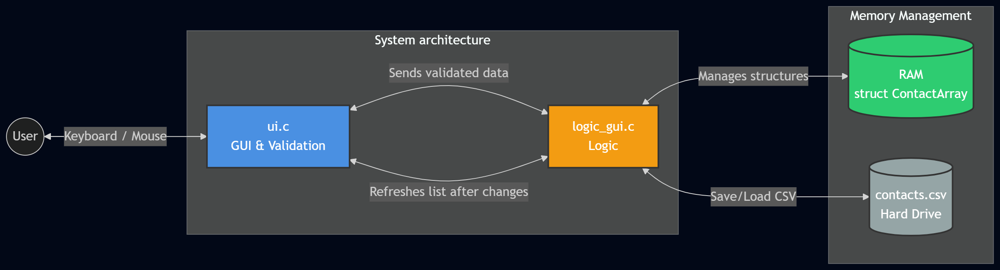
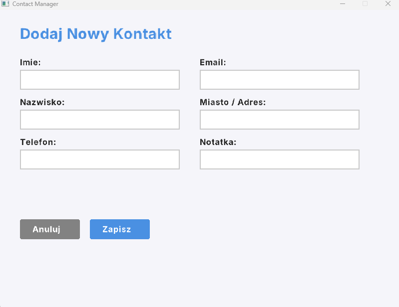
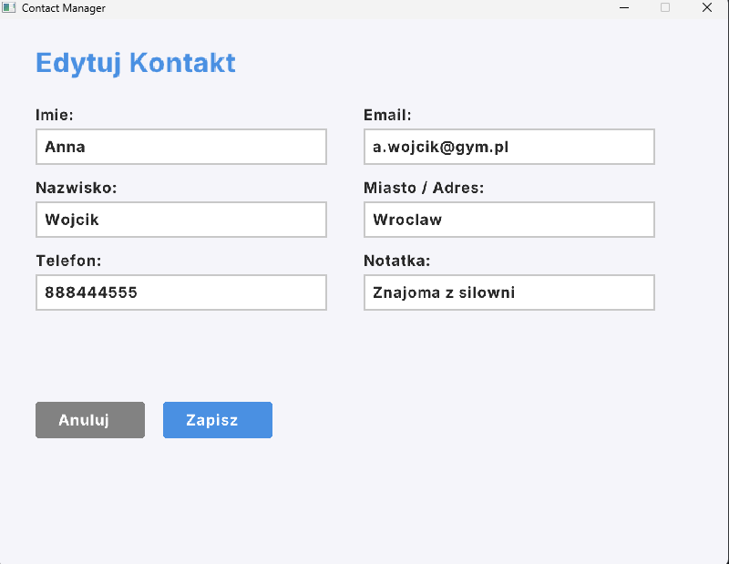
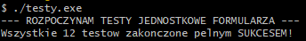

# Contact Manager

An interactive Contact Manager GUI application written in C using the **Raylib** library. This project was developed as part of the Low-level Programming course (2025/2026) and demonstrates modular architecture, dynamic memory management, file I/O, and input validation.

## 🚀 Features

* **Add / Edit / Delete Contacts:** Full CRUD functionality with a graphical user interface.
* **Smart Sorting:** Contacts are automatically sorted alphabetically by first name.
* **Search Functionality:** Quickly filter contacts by first name, last name, or phone number.
* **Persistent Storage:** Data is automatically loaded from and saved to a `contacts.csv` file upon application startup and exit.
* **Robust Input Validation:**
  * Mandatory fields (first/last name) allow only letters, spaces, hyphens, and apostrophes.
  * Phone numbers must follow the `+48XXXXXXXXX` or `9-digit` format.
  * Email addresses must contain `@` and a valid domain.
* **Security:** Built-in buffer overflow protection enforcing input length limits (`strncpy` safe copies).

## 🏗️ Architecture

* `main.c` - Entry point, initialization, and memory cleanup.
* `logic_gui.c` - Business logic, dynamic memory management (`malloc`, `realloc`, `free`), and array manipulation.
* `ui.c` - Graphical User Interface (Raylib) and event handling.
* `validation.c` - Standalone validation logic.
* `io.c` - File operations (CSV reading/writing).

## 💾 Memory Management

The application stores contacts in a dynamic array (`struct ContactArray`). It initializes with a set capacity and automatically doubles its size using `realloc()` when full. Proper cleanup (`free`) is executed before exiting the program to prevent memory leaks.

## 🛠️ Prerequisites & Building

To compile and run this project, you need:
* **GCC Compiler** (e.g., via MSYS2/MinGW on Windows)
* **Make**
* **Raylib** library (included in the `raylib/` directory)

### Compilation
Simply navigate to the project directory in your terminal and run:
make

The project includes standalone unit tests for the input validation module (testing edge cases for names, phone numbers, and emails using assert).
To run the unit tests:
gcc src/test_validation.c src/validation.c -o testy.exe
./testy.exe

